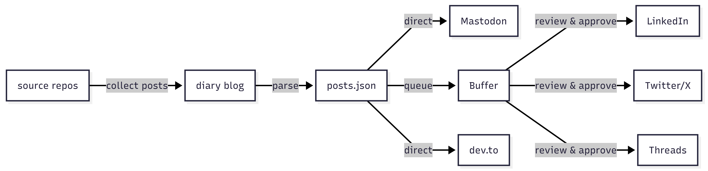
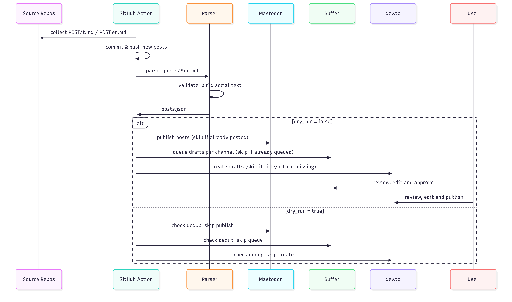

#### Diary of a lazy developer

Tech posts from my projects. Each post lives in its project repo as `POST.it.md` and `POST.en.md`, and gets published here automatically by a GitHub Action.

- Theme: [leonids](https://github.com/bilardi/leonids) (Jekyll)
- Automation: [publish.yml](https://github.com/bilardi/diary/blob/master/.github/workflows/publish.yml)
- Sources: [sources.yml](https://github.com/bilardi/diary/blob/master/sources.yml)

## Prerequisites

- [Docker](https://docs.docker.com/get-docker/) and Docker Compose
- `gh` CLI (optional, for manual workflow trigger)

## Publishing

Posts are collected from source repos and published to the blog, then cross-posted to social platforms.



EN posts go directly to dev.to (as draft) and Mastodon; Buffer queues them for LinkedIn, Twitter/X and Threads, where you review and approve before publishing.



Scheduled publishing (every Saturday at 6:00 UTC) is currently disabled; trigger manually.

To trigger it manually:

1. Go to Actions > Publish posts
2. Click "Run workflow" > "Run workflow"

Or from CLI:

```sh
gh workflow run publish.yml
```

## Cross-posting

All secrets go in repo Settings > Secrets and variables > Actions > New repository secret.

### dev.to (draft)

1. On dev.to: Settings > Extensions > DEV Community API Keys > Generate API Key
2. Secret: `DEV_TO_API_KEY`

### Mastodon (public post with image)

1. On mastodon.social: Settings > Development > New Application > select read, write and profile
2. Copy the token: `MASTODON_ACCESS_TOKEN`

### Buffer (LinkedIn, Twitter, Threads queue with review)

1. Create a free account on [buffer.com](https://buffer.com) and connect LinkedIn, Twitter/X and Threads
2. On buffer.com: My Organization (bottom left) > Apps & Integrations > API (beta) > + New Key
3. Secret: `BUFFER_ACCESS_TOKEN`

## Post frontmatter

Each post in a source repo has this frontmatter:

```yaml
---
title: "Docker on EC2 with Terraform"
date: 2026-04-10
categories: [devops]
tags: [terraform, docker, aws, ec2]
repo: bilardi/aws-docker-host
social_summary: "I wrote my first article in the #DiaryOfALazyDeveloper series 🚀\n\n..."
---
```

| Field | Required | Used by |
|-------|----------|---------|
| title | yes | blog, all social |
| date | yes | blog URL |
| categories | yes | blog |
| tags | yes | blog, social hashtags |
| repo | yes | collect-posts.sh |
| social_summary | no | EN posts only. Used by Mastodon, Buffer (LinkedIn/Threads). If missing, title is used. Twitter always uses title (280 char limit). Must be under 500 characters including link and hashtags (Mastodon/Threads limit). Buffer counts in UTF-16 code units: emoji above BMP (e.g. 🚀, 🔮, 😄) count as 2 characters each. |

`#DiaryOfALazyDeveloper` is added automatically on all social posts.

## Project structure

```
_layouts/  # leonids theme: page templates
_includes/  # leonids theme: reusable HTML partials
_sass/  # leonids theme: SCSS stylesheets
css/  # leonids theme: compiled CSS
js/  # leonids theme: JavaScript
_posts/  # generated by GitHub Action (gitignored)
img/  # diagrams and favicon
.github/workflows/
    publish.yml  # GitHub Action: collect posts + cross-post
    collect-posts.sh  # clones source repos, copies POST files
    devto-publish.sh  # publish to dev.to as draft
    mastodon-publish.sh  # publish to Mastodon
    buffer-publish.sh  # queue to Buffer (LinkedIn, Twitter, Threads)
sources.yml  # list of repos to scan for POST.it.md / POST.en.md
docker-compose.yml  # local Jekyll server
_config.yml  # Jekyll configuration
```

## Development

```sh
docker compose up
```

If something is not updated,

```sh
rm -rf _site .jekyll-cache .jekyll-metadata
touch .jekyll-metadata; chmod 777 .jekyll-metadata
touch Gemfile.lock; chmod 777 Gemfile.lock
docker compose up
```

Not commit (there are also in the .gitignore file)

* _site
* .jekyll-cache
* .jekyll-metadata
* Gemfile.lock

## Blog post

- [Italian](POST.it.md)
- [English](POST.en.md)

## License

This repo is released under the MIT license. See [LICENSE](LICENSE) for details.
